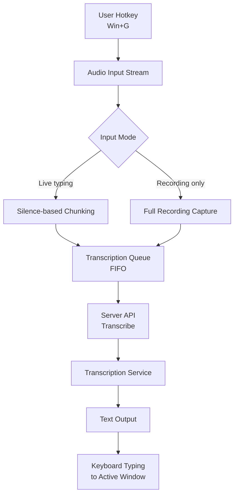

# Whisper Typer

Push-to-talk voice transcription using Faster-Whisper.
Supports Windows, macOS, and Linux.

## Quick Start

1. From the project root, start the app:

   ```powershell
   uv run client_ui.py
   ```

2. In the app:
   - Server is auto-started on launch if not already running.
   - If it does not auto-start, open **Server** → click **Start Local**.

3. In **Transcribe**:
   - Pick a model.
   - Select an input mode:
     - **Live typing**: sends chunks after short pauses.
     - **Recording only**: sends everything when you stop.
   - Press **Win+G** to start/stop recording.
   - Text is typed into the active window automatically.

## Flow logic



- User presses `Win+G` to toggle recording.
- Audio is captured from input stream.
- App checks selected mode:
  - **Live typing** → chunks split by silence windows and enqueued.
  - **Recording only** → all chunks captured until stop, then enqueued.
- Queue processes each chunk in order (FIFO).
- For each chunk:
  - Send audio to server via API.
  - Server returns transcribed text.
  - Text is typed into the active window via keyboard simulation.

---

## Hotkeys & Auto-typing

The client runs a global hotkey listener:

- **Win+G** (Windows) or **Cmd+G** (macOS) — Toggle recording.
- When recording is stopped, the client waits for the transcription and then **simulates keyboard typing** to insert the text into the currently focused window.

> **macOS Users:** 
> 1. You must grant **Accessibility** permissions to your terminal (e.g., iTerm or Terminal.app) for the auto-typing to work.
> 2. Grant **Microphone** permissions when prompted.

### System tray icon colors

| State | Color | Meaning |
|-------|-------|---------|
| Idle (server online) | 🟢 Green | Server is running, ready to transcribe |
| Server offline | ⚫ Black | Server is not reachable |
| Recording | 🔴 Red | Audio is being captured |
| Processing | 🟣 Purple | Transcribing audio |

---

## Requirements

- **OS:** Windows, macOS, or Linux
- **Python:** 3.10+
- **Package manager:** [uv](https://github.com/astral-sh/uv) (recommended)
- **Docker:** Optional, for isolated container deployment

---

## Installation

1. **Install `uv`** (if you haven't already):
   ```powershell
   powershell -c "irm https://astral.sh/uv/install.ps1 | iex"
   ```
   *For macOS/Linux:*
   ```bash
   curl -LsSf https://astral.sh/uv/install.sh | sh
   ```

2. **Clone the repo**:
   ```bash
   git clone https://github.com/sharadcodes/whisper-typer.git
   cd whisper-typer
   ```

3. **Run the app**:
   ```bash
   uv run client_ui.py
   ```

---

## Contributing

Contributions are welcome! Please see [CONTRIBUTING.md](CONTRIBUTING.md) for details.

---

## License

This project is licensed under the Apache License 2.0. See the [LICENSE](LICENSE) file for details.
