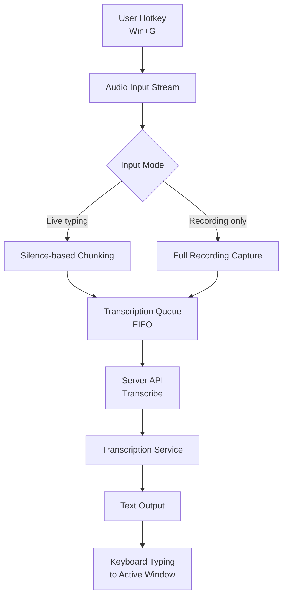

# Whisper Typer

Push-to-talk voice transcription using Faster-Whisper.
Supports Windows, macOS, and Linux.

## What you need

- **Python 3.12.8** (via `uv`)
- **`uv`** installed
- Internet access for first-run model download (if not cached)

## Run in 3 steps

1. From the project root, start the app:

   ```powershell
   uv run client_ui.py
   ```

2. In the app:
   - Server is auto-started on launch if not already running.
   - If it does not auto-start, open **Server** → click **Start Local**.

3. In **Transcribe**:
   - Pick a model.
   - Select an input mode:
     - **Live typing**: sends chunks after short pauses.
     - **Recording only**: sends everything when you stop.
   - Press **Win+G** to start/stop recording.
   - Text is typed into the active window automatically.

## Flow logic



- User presses `Win+G` to toggle recording.
- Audio is captured from input stream.
- App checks selected mode:
  - **Live typing** → chunks split by silence windows and enqueued.
  - **Recording only** → all chunks captured until stop, then enqueued.
- Queue processes each chunk in order (FIFO).
- For each chunk:
  - Send audio to server via API.
  - Server returns transcribed text.
  - Text is typed into the active window via keyboard simulation.

## Notes

- Transcripts can be reviewed from the History tab.
- Optional: create a `.env` file for `WHISPER_MODEL` or `HF_TOKEN` settings.
