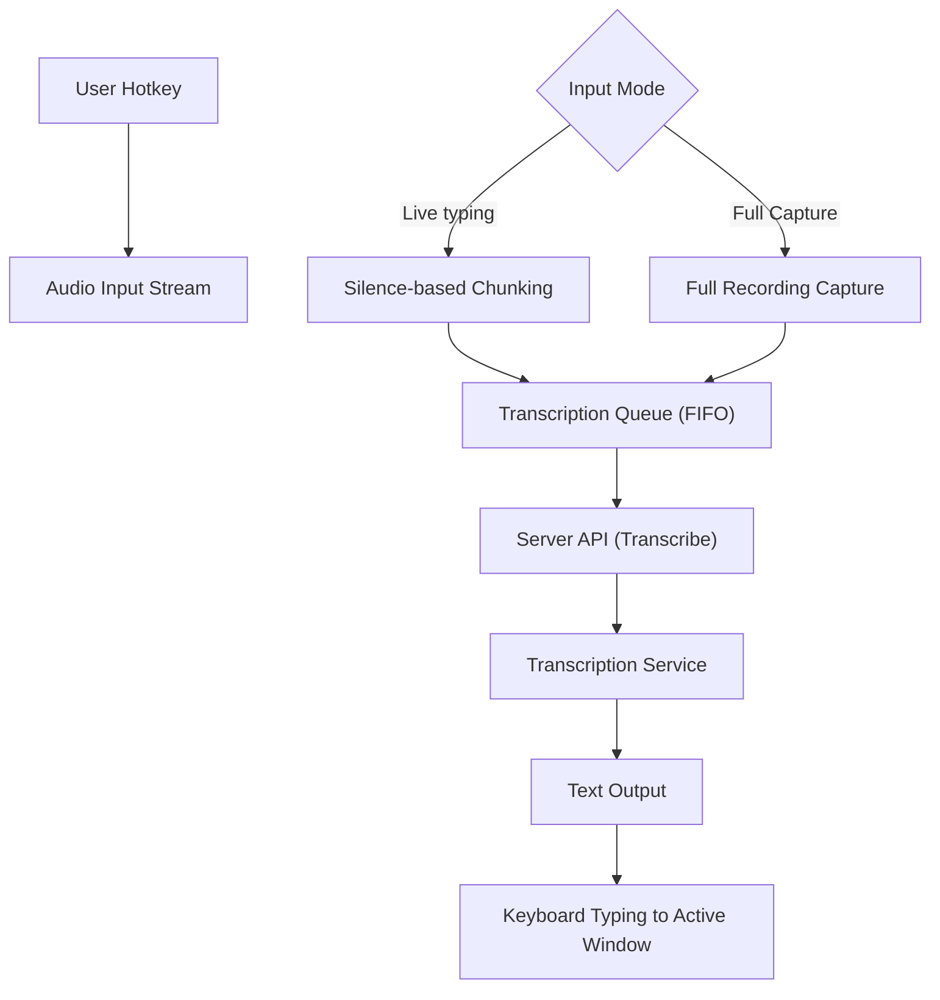

# Whisper Typer

Push-to-talk voice transcription using Faster-Whisper.
Supports Windows, macOS, and Linux.

## Quick Start

1. **Start the app**:
   ```powershell
   uv run run.py
   ```

2. **In the app**:
   - The server auto-starts on launch.
   - Choose a **Model** and **Input Mode** (Live or Full Capture).
   - Press **Win+G** (Windows) or **Cmd+G** (macOS) to start/stop recording.
   - Text types into your active window automatically.

---

## Installation

If you want to install it as a global tool:
```powershell
uv pip install -e .
whisper-typer
```

---

## Flow logic



- User presses `Win+G` to toggle recording.
- Audio is captured from input stream.
- App checks selected mode:
  - **Live typing** → chunks split by silence windows and enqueued.
  - **Full Capture** → all chunks captured until stop, then enqueued.
- Queue processes each chunk in order (FIFO).
- For each chunk:
  - Send audio to server via API.
  - Server returns transcribed text.
  - Text is typed into the active window via keyboard simulation.

---

## Hotkeys & Auto-typing

The client runs a global hotkey listener:

- **Win+G** (Windows) or **Cmd+G** (macOS) — Toggle recording.
- When recording is stopped, the client waits for the transcription and then **simulates keyboard typing** to insert the text into the currently focused window.

> **macOS Users:** 
> 1. You must grant **Accessibility** permissions to your terminal (e.g., iTerm or Terminal.app) for the auto-typing to work.
> 2. Grant **Microphone** permissions when prompted.

### System tray icon colors

| State | Color | Meaning |
|-------|-------|---------|
| Idle (server online) | 🟢 Green | Server is running, ready to transcribe |
| Server offline | ⚫ Black | Server is not reachable |
| Recording | 🔴 Red | Audio is being captured |
| Processing | 🟣 Purple | Transcribing audio |

---

## Requirements

- **OS:** Windows, macOS, or Linux
- **Python:** 3.10+
- **Package manager:** [uv](https://github.com/astral-sh/uv) (recommended)
- **Docker:** Optional, for isolated container deployment

---

## Configuration

The application stores data in `~/.whisper-typer/` by default. You can customize settings using a `.env` file in the project root:

- `WHISPER_MODEL`: Default model (e.g., `tiny`, `small`, `medium`).
- `WHISPER_MODELS_DIR`: Custom path for model storage.
- `HF_TOKEN`: Hugging Face token for private models.

---

## Contributing

Contributions are welcome! Please see [CONTRIBUTING.md](CONTRIBUTING.md) for details.

---

## License

This project is licensed under the Apache License 2.0. See the [LICENSE](LICENSE) file for details.

---

## About the Author

**Sharad Raj Singh Maurya**  
AI Engineer and Open Source enthusiast.  

- **GitHub:** [@sharadcodes](https://github.com/sharadcodes)  
- **Project:** [Whisper Typer](https://github.com/sharadcodes/whisper-typer)  

Feel free to reach out for collaborations or to report any issues!
